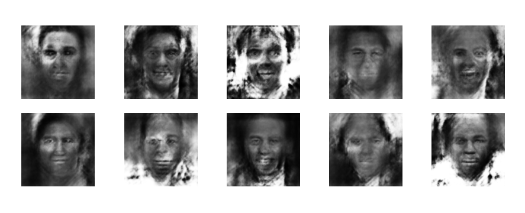

# Face Generation Using GANS

Using the Keras deep learning API and a dataset of 985 images of celebrity faces (256x256 px), the following code was able to leverage a generative-adversarial architecture to produce semi-photorealistic greyscale images of human faces.

The generative model uses a random (Gaussian) 100 dimensional vector as an input and generates a 256x256 pixel grayscale images using a convolutional neural network. 

### Training Data Example

### Image Generation Example (20 Epochs)

### Image Generation Example (176 Epochs)

### Video of Training Progress
https://www.linkedin.com/posts/fmahboub_gans-neuralnetworks-activity-6730575941287985152-ZTXZ

### References
https://machinelearningmastery.com/how-to-develop-a-generative-adversarial-network-for-an-mnist-handwritten-digits-from-scratch-in-keras/
